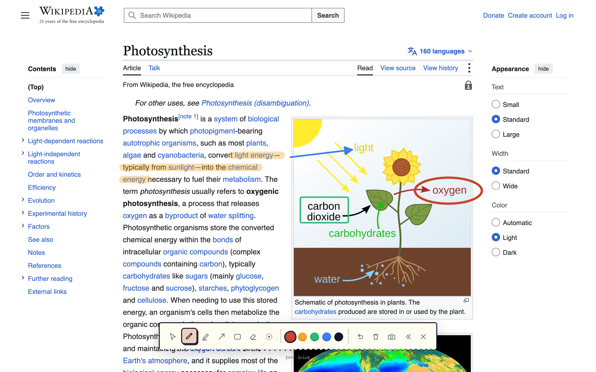
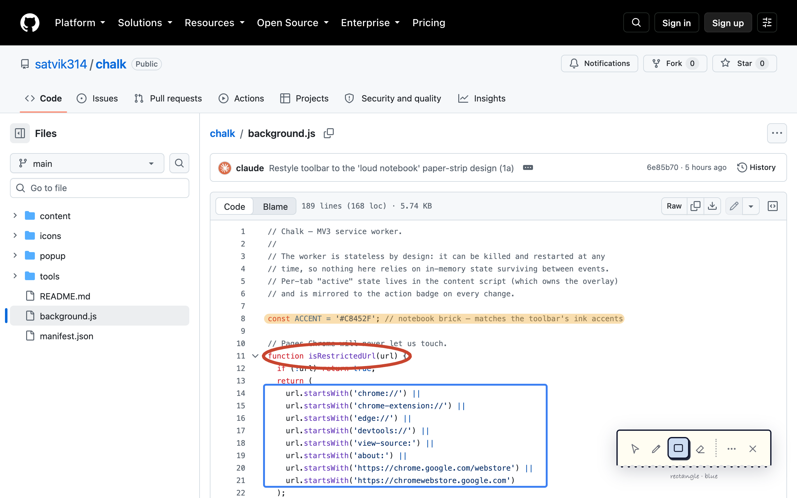
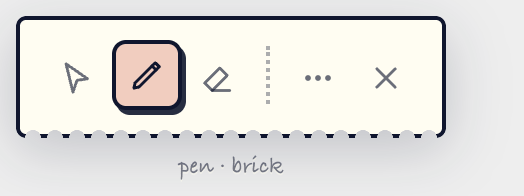
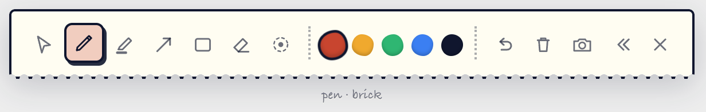

# Chalk

**A Chrome extension that turns any webpage into a whiteboard.**

Press `Alt+D`, draw on top of whatever is on screen, press `Esc` to leave it exactly as you found it.

No account, no build step, no dependencies, no network calls — a folder of plain files you load into Chrome once.

---

## Why

Explaining something on a call always comes down to the same sentence: *"see this bit here?"* The usual answers are bad. Screen-annotation apps cost money and hijack the whole desktop. Slides mean you leave the real thing behind. Cursor-waggling makes everyone squint.

Chalk puts the ink on the page you are already looking at. The drawing layer is transparent and lives *in the tab*, so the site keeps working underneath: your ink is anchored to the content and scrolls with it, one key drops you back to clicking links, and the whole thing disappears when you're done.

## Proof

Teaching from an article — highlighter on the definition, a circle around the output, a box around the input, an arrow tying the text to the diagram:

Walking a teammate through code, with the toolbar in its compressed state, parked out of the way:

The toolbar starts small and opens to the full kit — drag it anywhere, and it remembers where you left it:

| Compressed | Expanded (`⋯`) |
| --- | --- |
|  |  |

*Every screenshot above is the real extension, captured headlessly by [`tools/shots.mjs`](tools/shots.mjs) — real clicks, real strokes, no mockups.*

## Install

Chalk isn't on the Web Store. Loading it yourself takes about thirty seconds:

1. Download the repo — **Code → Download ZIP**, then unzip it (or `git clone https://github.com/satvik314/chalk.git`).
2. Open `chrome://extensions`.
3. Turn on **Developer mode** (top-right).
4. Click **Load unpacked** and pick the folder containing `manifest.json`.

Press `Alt+D` (`⌥D` on Mac) on any page and start drawing.

Teaching from local HTML files? On Chalk's card click **Details** and turn on **Allow access to file URLs** — Chrome requires that once, for any extension, before it can touch `file://` pages.

Requires Chrome 116+ (or any Chromium browser: Edge, Brave, Arc).

## Use

| Action | How |
| --- | --- |
| Toggle drawing mode | `Alt+D` / `⌥D`, or click the Chalk icon |
| Tools | `V` interact · `O` observe (laser) · `P` pen · `H` highlighter · `A` arrow · `R` rectangle · `E` eraser |
| Colors | `1`–`5`, or click a swatch |
| Undo / redo | `Ctrl/⌘+Z` · `Ctrl/⌘+Shift+Z` |
| Clear everything | Trash button (undoable) |
| Save a snapshot | Camera button — the toolbar hides itself, then a PNG lands in `Downloads/Chalk/` |
| Move the toolbar | Drag it by any empty spot |
| Expand / compress | The `⋯` button |
| Done | `Esc`, or the `✕` |

Two behaviors worth knowing:

- **`V` — interact.** Pointer events fall through to the page, so you can scroll, click and type while the ink stays on screen. The drawings are stored in document coordinates, so they stay stuck to the paragraph they were drawn on.
- **`O` — observe.** A laser pointer with a fading trail; click for an expanding ring. Nothing is committed, so there's nothing to erase.

Ink survives toggling the mode off and on. It clears itself when you navigate to a different page — including single-page-app route changes — so last page's scribbles never haunt the next one.

## How it works

The whole extension is a service worker, a content script and a popup — about 1,600 lines of plain JavaScript and CSS. Manifest V3, no bundler, no framework.

1. **The toggle.** `background.js` is a deliberately stateless service worker: it can be killed and restarted at any moment, so the only thing it does is relay a toggle message to the tab and mirror the tab's reply onto the action badge (`ON`). Per-tab state lives with whoever owns the pixels — the content script.
2. **The overlay.** `content/chalk.js` builds a full-viewport canvas and the toolbar inside a **closed shadow root** at the top of the z-index. Page CSS can't reach in, Chalk's CSS can't leak out. Until your first toggle the host is `display: none`, so an installed-but-idle Chalk is indistinguishable from no extension at all.
3. **Vector ops, not pixels.** Committed work is a list of ops — strokes, shapes, eraser paths, clears — replayed onto an offscreen *base* canvas. The visible canvas is always `base + the stroke currently under your cursor`. That one decision buys exact undo/redo, a highlighter that keeps a single clean alpha instead of darkening where it overlaps itself, and a free redraw on resize.
4. **Document-space coordinates.** Points are captured as `client + scroll` and the replay transform subtracts the current scroll, which is why ink stays glued to the content while the page moves under it.
5. **Snapshots.** The toolbar adds a `capture-hide` class, waits two frames for it to actually paint, then asks the worker for `captureVisibleTab` and hands the data URL to the downloads API. You get the annotated page, not a photo of the tool.
6. **Icons from code.** `tools/make-icons.mjs` renders the action icons — a supersampled signed-distance-field board with a tapered chalk swoosh — and encodes the PNGs by hand with zero dependencies. `node tools/make-icons.mjs` regenerates all four sizes.

## What it can touch

The permissions are the smallest set that makes the above work, and Chalk sends nothing anywhere:

| Permission | Why |
| --- | --- |
| `activeTab`, `scripting` | Inject the overlay into the tab you're on (including tabs that were already open at install) |
| `storage` | Remember your tool, color, toolbar position and compressed/expanded state |
| `downloads` | Save snapshots to `Downloads/Chalk/` |
| `<all_urls>` | Draw on any site, since teaching happens anywhere |

Chrome forbids extensions on its own pages (`chrome://…`) and the Web Store. Chalk detects those tabs and swaps the icon's click for a short popup explaining why, rather than silently doing nothing — same for `file://` pages before you've granted file access.

## Good for

- Live teaching and workshops — annotate the docs, the dashboard, the actual product
- Code walkthroughs and design reviews on a call
- Marking up a page before sending it back as a screenshot
- Recording tutorials without paying for a screen-annotation app

## Contributing

Issues and PRs welcome — new tools, better ink, sharper icons. A good PR keeps the no-build-step, no-dependency promise, and if it changes what the toolbar looks like, re-run `node tools/shots.mjs` so the README's proof stays honest.

## License

[MIT](LICENSE)
